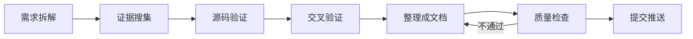

# 调研链路

## 结论

高质量调研不是“搜到很多”，而是把问题变成可验证判断，再用一手证据确认，最终形成可重放的决策记录。以下七步必须顺序执行；前一步证据不足时，不提前写确定性结论。

## 1. 需求拆解

先把宽泛问题拆成能被证据回答的子问题，例如“选什么框架”“机制是否真实存在”“迁移成本由谁承担”。同步定义业务目标、技术边界、排除项和截止时间。

产物是一页问题清单。每个子问题都应包含判断标准和预期证据类型。框架评估固定回答四件事：解决什么问题、为什么采用、在哪一层、何时重评。

退出条件：团队能明确判断某条证据是否足以回答某个子问题。

## 2. 证据搜集

只搜官方文档、官方 GitHub、官方博客、官方 case study 和原始论文。论文与资料只看 2025 年及以后。先找原始入口，再记录标题、发布方、日期、版本和链接。

主动排除 SEO 博客、二手媒体、star 数、无法验证的性能数字。未知 GitHub 仓库不能因为名称相似就视为官方仓库。候选框架若相关度低或没有开源源码，立即排除。

可用 `scripts/search.py` 搜索 2025 年及以后的 arXiv 论文，或对已有 URL 做可信域名筛选。脚本输出是候选，不是最终证据，仍需人工判断相关性。

退出条件：每个子问题至少有一个一手候选来源，并记录缺口。

## 3. 源码验证

文档声称存在的关键机制，必须回到官方源码确认。把官方 GitHub 文件链接转换为 `raw.githubusercontent.com` 内容，检查机制关键词、符号名和相邻上下文；最终记录 commit SHA 或 release 版本。

典型检查包括 Codex `multi_agents.rs` 中的 `spawn_agent`、OpenHands `resource_lock_manager.py`、DSH `architecture.md` 中的 `Capability Seam`。这些名称只是验证方式示例，不代表本项目预先确认其当前状态。

可用 `scripts/verify_source.py` 输出抓取地址、命中词、行号和总体结果。抓取失败、关键词未命中或版本无法确定，都必须如实记录。

退出条件：核心机制有源码级证据，或被明确标记为未验证。

## 4. 交叉验证

把官方文档、源码、官方博客或 case study 放在一起对照。理想状态是三角证据：文档解释承诺，源码确认实现，官方案例说明适用边界。

检查来源是否讨论同一版本、同一功能和同一部署方式。冲突时优先记录冲突，不自行拼接成确定结论。能引原文时引用短句，并提供上下文链接。

退出条件：关键结论由至少两类官方来源支持；只有单一来源的结论显式标注证据强度。

## 5. 整理成文档

先写结论和采用理由，再写事实与过程。区分“来源明确陈述的事实”“依据多条证据形成的推断”“面向当前项目的建议”。每个结论附可点击证据链接。

比较多个方案时，统一评估维度并给出决策表。架构或链路关系复杂时使用 Mermaid 对照图。知识文档只描述机制、文件位置和符号名，不粘贴源码实现。

退出条件：读者先看结论、证据表和决策表，就能理解选择及其代价。

## 6. 质量检查

运行 `scripts/quality_check.py`，确保每份文档破折号不超过 2 个、无敏感词、相对链接存在、外部链接格式有效，并统计 Mermaid 块。重要外链使用 `--check-external` 实际请求验证。

脚本只做轻量结构检查，不能证明 Mermaid 一定可渲染。所有 Mermaid 块还要在目标文档平台或可信渲染器中实测。修复后重新运行，不能静默忽略错误。

退出条件：自动检查通过，外链与 Mermaid 按任务风险完成实际验证。

## 7. 提交推送

提交前查看变更范围，确认没有密钥、令牌、个人信息、缓存、临时抓取结果或其他敏感文件。提交信息说明本次结论或能力变化，随后执行 git commit 和 push。

若用户未授权提交或明确要求不提交，只交付干净、已验证的工作区，不自行 commit 或 push。推送失败要报告错误和仓库状态。

退出条件：授权范围内的变更已推送，或按要求停留在可提交状态。
