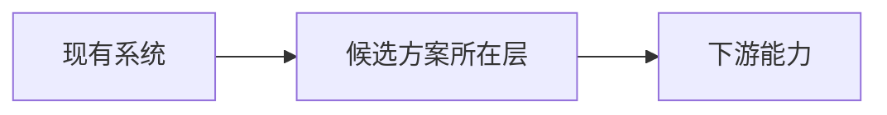

# 【调研主题】

> 日期：【YYYY-MM-DD】  
> 状态：【草稿 / 已验证 / 待重评】  
> 范围：【技术框架选型 / 论文检索 / 竞品对比】

## 结论

【先用三到五句话写推荐方案、核心理由、主要代价和证据强度。证据不足时明确写“尚未验证”。】

## 为什么现在要做

【说明业务问题、触发条件和不处理的后果。WHY 优先，不复述功能清单。】

## 问题与边界

- 主问题：【待填写】
- 子问题：【待填写】
- 决策标准：【待填写】
- 排除项：【待填写】
- 资料时间范围：2025 年及以后

## 证据表

| 结论 | 证据 | 来源 | 链接 |
|---|---|---|---|
| 【可验证结论】 | 【短原文、机制说明或验证结果】 | 【官方文档 / 官方 GitHub / 原始论文 / 官方 case study】 | 【填写真实、可点击链接】 |

说明：删除所有填写提示后再交付。禁止占位链接、假 arXiv 编号和无法复核的数字。

## 候选方案

### 【框架或方案名】

- 解决什么问题：【待填写】
- 为什么采用：【待填写】
- 在哪一层：【待填写】
- 何时重评：【待填写】
- 开源源码：【仓库与版本，待填写】
- 证据强度：【高 / 中 / 低，并解释原因】

## 决策表

| 方案 | 相关度 | 开源源码 | 核心机制证据 | 集成代价 | 风险 | 决策 |
|---|---|---|---|---|---|---|
| 【方案 A】 | 【高 / 中 / 低】 | 【有 / 无】 | 【已验证 / 未验证】 | 【高 / 中 / 低】 | 【简述】 | 【采用 / 观察 / 排除】 |

## 架构位置

【说明边界、输入输出、失败影响，不粘贴源码实现。】

## 源码验证记录

| 仓库 | 文件 | commit 或版本 | 机制关键词 | 结果 |
|---|---|---|---|---|
| 【待填写】 | 【待填写】 | 【待填写】 | 【待填写】 | 【命中 / 未命中 / 抓取失败】 |

## 风险与未决问题

- 【证据冲突、访问限制、版本风险或待验证项】

## 重评条件

- 【版本变化、规模阈值、成本阈值、关键机制变化或业务目标变化】

## 质量检查

- [ ] 每个重要结论都有真实、可点击的一手证据链接
- [ ] 论文与资料均为 2025 年及以后
- [ ] 框架相关且有开源源码
- [ ] 每份文档破折号不超过 2 个
- [ ] 已扫描敏感词并检查链接
- [ ] Mermaid 已在目标平台实测渲染
- [ ] 已区分事实、推断与建议
